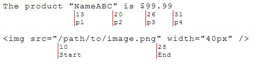

StrViz is a little tool to visualize positions of a string.

StrViz can make it easier to scrape a website, analyze xml or filter entities from a raw string. 

** Demo

This code creates the following output.

`````javascript
StrViz.visualize(
    '',
    [
        { 'position': 10, 'text': 'Start'},
        { 'position': 28, 'text': 'End'}
    ]
);
`````


** Download

Just download all three files.
jQuery is required.

** Contributing 
Anyone and everyone is welcome to contribute.